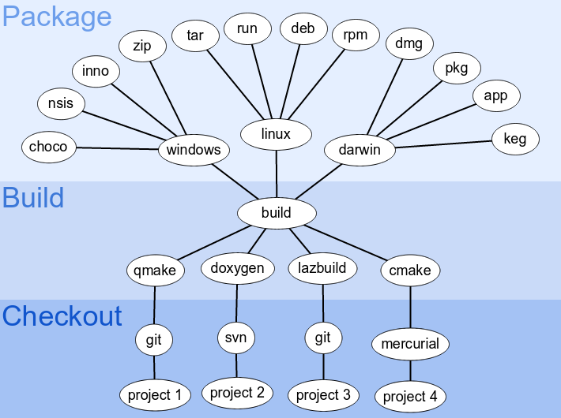

packthing is a high-level integration tool that makes packaging and
distributing your application simple.

-   **One project, many formats** - quickly produce a versioned
    distribution for any project type that's supported.
-   **Configuration is simple** - prepare your project for deployment in
    just a few steps.
-   **Not an expert? Not a problem** - save yourself hundreds of hours
    learning operating system details; get it done and get on with your
    life.

# Documentation

You can find the documentation on how to use Packthing on the [LameStation Wiki](https://lamestation.atlassian.net/wiki/display/PACK/).

# Bug Reporting

Please submit bugs to the [issue tracker](https://github.com/lamestation/packthing/issues).

# Author

Packthing was created by LameStation to support the [PropellerIDE project](https://github.com/parallaxinc/PropellerIDE).
